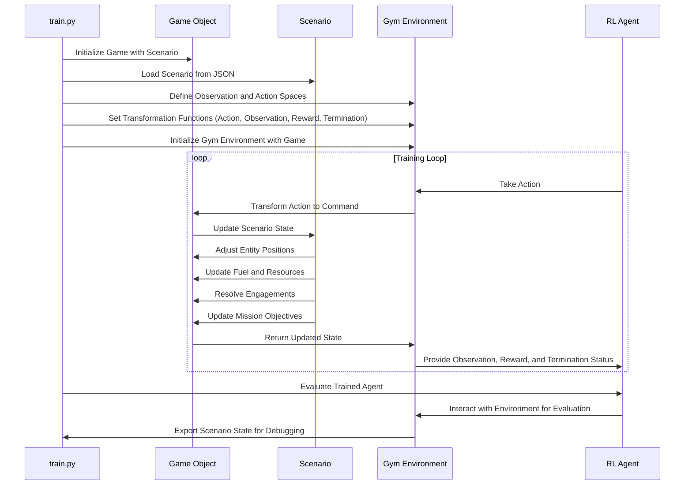

### *Layout of BLADE and Its Interface with OpenAI Gymnasium*

To effectively use the **BLADE** environment with OpenAI Gymnasium, it’s essential to understand its architecture and how it bridges the simulation features of Panopticon with the modular reinforcement learning ecosystem of Gym. Here’s a structured breakdown:

### **BLADE Layout**

The BLADE environment acts as a wrapper that integrates the simulation capabilities of the Panopticon system with the reinforcement learning framework. Here’s how its key components are organized:

1. **Simulation Backbone**
   - **Game**: Manages the current state of the simulation, including entities (e.g., aircraft, ships, facilities) and missions.
     - Provides the `step` method, which processes actions, updates the simulation state, and returns observations, rewards, and termination conditions.
   - **Scenario**: Represents the configuration of a specific simulation, including the entities, sides, and missions involved.

2. **Entities and Missions**
   - **Entities**: Aircraft, ships, facilities, and airbases with customizable properties like position, speed, and weapons.
   - **Missions**: Goals assigned to entities, such as patrols or strikes, which guide their behavior within the scenario.

3. **Utility Modules**
   - Constants and utility functions to calculate distances, headings, and other spatial dynamics.
   - Filtering and logging mechanisms to extract or record meaningful data.

### **Interface with OpenAI Gymnasium**

BLADE leverages the Gymnasium API to create a reinforcement learning environment. Here's how it connects the dots:

1. **Environment Initialization**
   - The `BLADE` class inherits from `gym.Env` and serves as the Gym-compatible environment.
   - During initialization:
     - The `Game` object is provided to manage the simulation.
     - Observation and action spaces are defined, either with defaults or user customization.

2. **Key Gym API Methods**
   - **`reset()`**:
     - Resets the simulation to its initial state using the `Game` class.
     - Returns an initial observation and optional metadata.
   - **`step(action)`**:
     - Accepts an action, transforms it for the simulation, and applies it to the `Game` object.
     - Updates the simulation state and retrieves:
       - The next observation (`observation_filter_fnc` is applied if defined).
       - A reward value (`reward_filter_fnc`).
       - Termination status (`termination_filter_fnc`).
       - Additional info for debugging or diagnostics.
   - **`render()`** (Optional):
     - Provides visual feedback, useful for debugging or demonstrations.

3. **Customizable Interfaces**
   - **Action Transformation**: `action_transform_fnc` allows the user to map RL agent outputs (actions) into commands understood by the simulation, such as moving an aircraft.
   - **Observation Filtering**: `observation_filter_fnc` tailors the simulation state into meaningful observations for the RL agent, like the position of an aircraft or proximity to threats.
   - **Reward and Termination**:
     - `reward_filter_fnc`: Defines how agent performance is evaluated.
     - `termination_filter_fnc`: Sets conditions for ending an episode.

4. **Gym Spaces**
   - **Observation Space**: Describes the format and limits of data returned to the agent, e.g., aircraft latitude and longitude.
   - **Action Space**: Specifies the range and type of actions the agent can take, e.g., target coordinates for a movement command.

### **How It All Fits Together**
When you combine BLADE with Gymnasium, you get an environment that acts as a bridge between the high-fidelity simulation of Panopticon and the algorithms provided by reinforcement learning libraries like Stable-Baselines3. Here's the flow:

1. The agent interacts with the BLADE environment via the Gymnasium API.
2. Actions from the agent are transformed and applied to the simulation (`Game.step()`).
3. The simulation updates its state, calculates rewards, and checks for termination.
4. Filtered observations and rewards are returned to the agent, closing the loop.